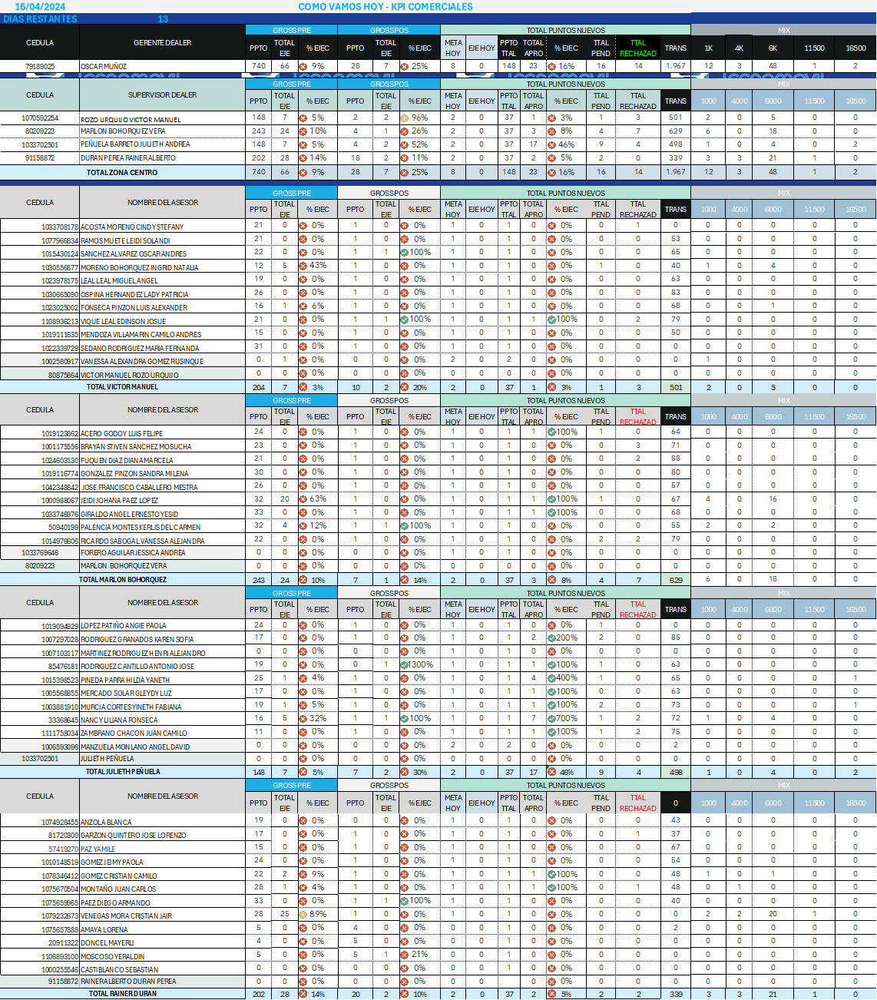

<html lang="es">
<head>
<meta charset="UTF-8">
<meta name="viewport" content="width=device-width, initial-scale=1.0">
<title>Imagen con Fondo, Margen y Título</title>

</head>
<body>
    

        <h1>TECNOMOVIL CENTRO</h1>
    

    

        
    

</body>
</html>
